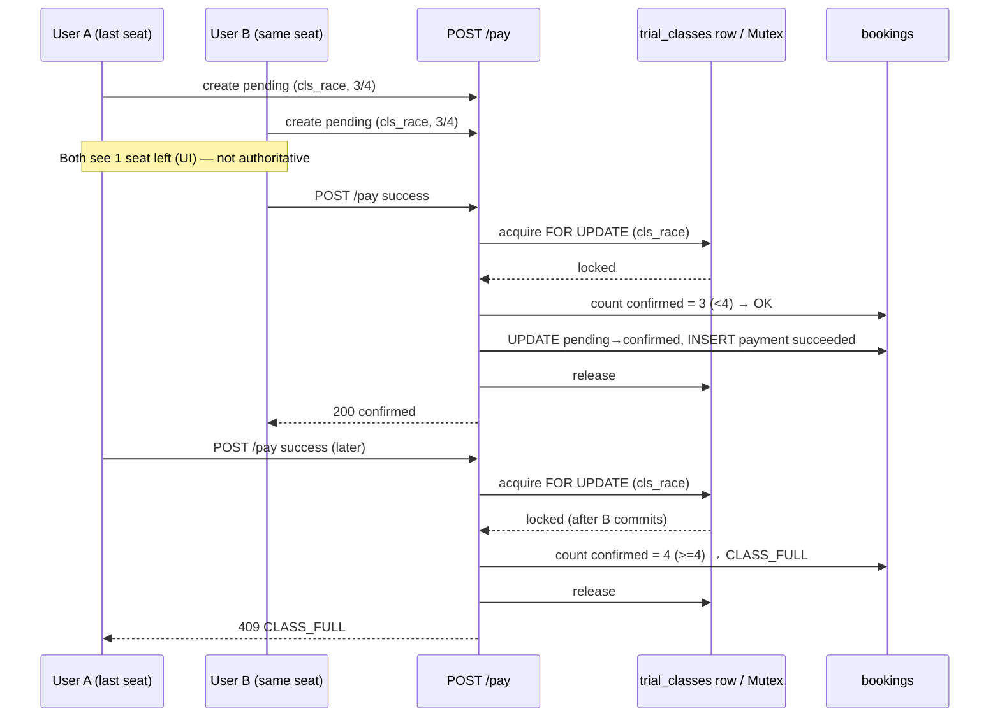

# Ottodot — Trial Booking (Capacity 4, Race-Safe)

Smallest working slice of Ottodot's trial booking system. Parents book a trial class for their child, pay (mock), and teachers see an accurate roster. Correctness under edge cases is prioritized over UI polish.

Stack: **Next.js 16 (App Router) + React 19 + TypeScript + Tailwind 4 + Zod + Supabase/Postgres (schema + in-memory fallback) + Vercel-ready**.

---

## How to run

```bash
# 1. Install
pnpm install

# 2. Run dev (no env vars required — uses in-memory store)
pnpm dev
# open http://localhost:3000

# 3. Verify invariants (no server needed)
pnpm verify
# or: npx tsx scripts/verify.mjs

# 4. Race test via HTTP (requires dev server running)
pnpm race
# or: BASE_URL=http://localhost:3000 node scripts/race.mjs

# 5. Production build
pnpm build && pnpm start
```

**Supabase (optional):** The app ships with a fully equivalent in-memory implementation so reviewers can run it with zero setup. To use real Postgres:

1. Create a Supabase project.
2. Run `supabase/schema.sql` then `supabase/seed.sql` in SQL Editor.
3. Add `.env.local` from `.env.example` with `NEXT_PUBLIC_SUPABASE_URL` / `NEXT_PUBLIC_SUPABASE_ANON_KEY`.
4. Wire `lib/store.ts` → `lib/supabase.ts` (the SQL function `confirm_booking` is the drop-in replacement for the in-memory mutex — see "Last-seat race" below).

Reset seed anytime: `POST /api/seed` or click **Reset seed** in UI. Also `GET /api/seed` shows current data.

---

## What you built

**User flows:**

- Parent selects child (filtered by parent) → picks a trial class with live availability (`confirmed_count / 4`) → creates a `pending_payment` booking → mocks payment success/failure → sees final status (`confirmed` / `payment_failed` / `pending_payment`).
- Admin/teacher views roster per class at `/roster` and via `GET /api/roster/[classId]` — only `confirmed` bookings.

**What counts as "confirmed roster":** only bookings with `status = 'confirmed'` after a successful `payment_attempt`. Everything else (`pending_payment`, `payment_failed`, `cancelled`) is excluded. Roster endpoint is the source of truth teachers see before class.

Minimal UI is at `/` (booking) and `/roster` (all classes). APIs are also directly curl-able for verification.

---

## Seed data — covers all required edge cases

| Class | State | How to demonstrate |
|-------|-------|--------------------|
| `cls_available` (Science Explorers, Ms. Putri) | **0/4** confirmed, 4 seats free. Plus one `pending_payment` (Kiko) and one `payment_failed` (Riko) seeded | **Available:** book Milo for cls_available → pay success → 1/4 |
| `cls_almost_full` (Math Masters, Mr. Adi) | **3/4** confirmed (Dina, Ella, Noah) — exactly 1 seat left | **3-confirmed + duplicate:** try booking Dina again → 409; race test with 2 new kids |
| `cls_full` (Robotics Intro, Mr. Ken) | **4/4** confirmed — full | Overbooking attempt → `CLASS_FULL` |
| `cls_race` (Space Lab, Dr. Nova) | **3/4** confirmed — dedicated race fixture | **Last-seat race:** create `stu_6`+`stu_7` pendings → concurrent `POST /pay` → only 1 wins |

Parents: Siti (par_1, kids Kiko/Milo), Budi (par_2, Dina/Riko), Anya (par_3, Ella/Sam), James (par_4, Noah).

**Duplicate:** `bk_dup_pending` — Kiko already has `pending_payment` for `cls_available` → second `POST /api/bookings` for same student+class returns `409 DUPLICATE_BOOKING`.

**Payment failure:** `bk_failed` — Riko's booking is `payment_failed` with a `failed` payment_attempt; not counted toward capacity, free to retry.

---

## Time spent

~7 hours total (scaffold + data model + transactional logic + validation/error best-practice layer + APIs + minimal UI + seed + verification scripts + hardened Postgres schema + docs). Backend-only slice (schema + `store.ts`/`lib/*` + routes + tests) ~4 hours.

---

## Assumptions

- Trial capacity is **fixed at 4** per spec; stored as `capacity` but validated `CHECK (capacity = 4)` so the rule is explicit and generalizable.
- A parent can only book for their own child (`student.parent_id` must match `parent_id`).
- `pending_payment` does **not** reserve a seat. Seats are only decremented on `confirmed`. This is a deliberate product decision: it avoids holding seats for unpaid/abandoned sessions and simplifies expiry (no TTL/job needed for demo). Alternative (hold seat on pending with expiry) is discussed in tradeoffs.
- Payment is mock/synchronous. Real provider would be Stripe/Midtrans with webhook; `payment_attempts` models that.
- Single trial per child per class: re-booking after `payment_failed`/`cancelled` is allowed; after `confirmed` or `pending_payment` it is not.
- Auth is out of scope — `parent_id` is passed explicitly (in production would come from session/JWT via RLS — see schema.sql RLS notes).
- Demo uses in-memory store; Postgres schema is provided and behaviorally equivalent.

---

## Backend Architecture & Design (Detailed)

### 1) Layered architecture — thin controllers, rich domain service

```
┌─────────────────────────────────────────────────────────────┐
│  UI (app/page.tsx, app/roster/page.tsx)                     │  ← convenience, never trust for invariants
├─────────────────────────────────────────────────────────────┤
│  API Routes (app/api/*) — thin controllers                  │  ← zod validation, AppError→HTTP, idempotency, logging
│    lib/validation.ts  lib/errors.ts  lib/api.ts             │     (parse → delegate → envelope)
├─────────────────────────────────────────────────────────────┤
│  Domain Service — lib/store.ts (InMemoryStore)              │  ← all business invariants, per-class Mutex
│    = BookingService + Repository in one for demo slice       │     (prod: replace with Postgres + confirm_booking())
├─────────────────────────────────────────────────────────────┤
│  Persistence                                                │
│    Demo:  Map<> + Mutex (in-process)                        │
│    Prod:  Postgres + confirm_booking()  SELECT FOR UPDATE   │  ← DB is final arbiter
└─────────────────────────────────────────────────────────────┘
```

**Best-practice rules enforced by this layering (`lib/store.ts:1`, `lib/validation.ts:1`, `lib/errors.ts:1`, `lib/api.ts:1`):**
- Routes never contain business logic — they only validate, call `store.*`, and format responses.
- Every invariant is re-checked inside the transactional boundary, not just at the route.
- IDs are `crypto.randomUUID` (`lib/store.ts:288`) not `Math.random`, envelope is consistent `{data}` / `{error,code}`.

**Request lifecycle (create → pay → roster):**
```
Parent UI → POST /api/bookings {parent_id,student_id,trial_class_id}
  → zod (lib/validation.ts:createBookingSchema) → store.createPendingBooking() → 201 {data: booking}
  → (user at payment step, no seat held)
  → POST /api/bookings/[id]/pay {simulate}
    → success: store.confirmBooking() inside mutex → check dup & capacity → 200 {data: confirmed}
    → failure: store.failBookingPayment() → 200 {data: payment_failed} (roster unchanged)
Teacher → GET /api/roster/[classId] → store.getRoster() WHERE status='confirmed'
```

### 2) Data model — ER + constraints

```
parents(id PK, name, email UNIQUE, created_at)
  1 ──∞ students(id PK, parent_id FK→parents, name, age 3-18)
  1 ──∞ bookings(id PK, student_id FK, trial_class_id FK, parent_id FK, status, created_at, updated_at)
          └──∞ payment_attempts(id PK, booking_id FK, status, amount_cents, provider_ref, created_at)
trial_classes(id PK, title, subject, starts_at, capacity=4 CHECK, teacher_name)
```

Full DDL + comments in `supabase/schema.sql:1`. Highlights:

| Table | Constraint / Index | Why it exists (best practice) |
|-------|--------------------|--------------------------------|
| `parents` | `email ~* regex` CHECK, `UNIQUE(email)` | Validate at DB, not just app; prevents bad data via direct SQL |
| `students` | `FK parent_id ON DELETE CASCADE`, `idx_students_parent` | Referential integrity; index for `getStudentsByParent` |
| `trial_classes` | `CHECK (capacity=4)` | Business rule explicit in DDL, not just docs |
| `bookings` | `CHECK status IN (...)`, `idx_bookings_class_status`, `idx_bookings_student_class` | Fast roster & dedup lookups; status is enum-like |
| `bookings` | `uniq_confirmed_booking WHERE status='confirmed'` | **Primary duplicate guard** — partial unique index, DB as final arbiter (`23505`) |
| `bookings` | `updated_at` trigger `set_updated_at()` | DB owns timestamps, not app clocks |
| `payment_attempts` | `FK booking_id ON DELETE CASCADE`, `CHECK amount_cents`, `idx_payments_booking` | Append-only audit, no mutation; search by booking |
| `idempotency_keys` | `PK key, idx expires_at` | Idempotent retries for `POST /api/bookings` via `Idempotency-Key` header |

**Why partial index, not full unique?** Trial allows retry after `payment_failed`/`cancelled` — only `confirmed` must be unique. A full `UNIQUE(student_id, trial_class_id)` would block legitimate retries. This is intentional and documented in `supabase/schema.sql:50`.

### 3) Booking state machine

```
              createPending
   ───────────────────────────►
             ┌─────────────────┐
             │ pending_payment │ ─── pay failure ──► payment_failed (terminal, retry via new booking)
             └──────┬──────────┘
                    │ pay success + capacity & dup OK (inside tx)
                    ▼
             ┌─────────────┐
             │  confirmed  │ ─── cancel ──► cancelled (frees seat, not used in happy path)
             └─────────────┘

Guards on transitions (see lib/store.ts:427 confirmBooking, supabase/schema.sql:89 confirm_booking):
  pending_payment → confirmed : booking.status == pending && no duplicate confirmed && countConfirmed < capacity (inside lock)
  pending_payment → payment_failed : booking.status == pending (no lock needed)
  confirmed → confirmed (replay) : idempotent, return same payment (webhook retry safe)
  any → cancelled : explicit admin action
```

Statuses (`lib/types.ts:1`):

- `pending_payment` — intent created, **no seat taken**. Waiting for payment. Not on roster.
- `confirmed` — payment succeeded **and** capacity/duplicate checks passed inside transaction. **Only** this counts toward `capacity` and roster.
- `payment_failed` — payment failed (mock failure). Never counts toward capacity. Allows retry (new booking).
- `cancelled` — explicit cancel, frees seat (modeled but not used in happy path).

### 4) API contract — validated, typed, consistent envelope

All routes use **Zod** (`lib/validation.ts:1`) at the edge — before any business logic — and return a consistent envelope via `lib/api.ts:1` (`{data}` on success, `{error,code,details}` on failure). HTTP status is derived from `lib/errors.ts:10` `STATUS_BY_CODE`.

| Endpoint | Method | Request (Zod) | Success | Errors | Notes |
|----------|--------|---------------|---------|--------|-------|
| `GET /api/trial-classes` | GET | — | `200 {data: TrialClassWithAvailability[]}` with `confirmed_count/available_seats/is_full` | — | `cache-control: no-store`, computed server-side |
| `GET /api/parents` | GET | — | `200 {data: Parent[]}` | — | — |
| `GET /api/students?parentId=` | GET | `parentId: idSchema` | `200 {data: Student[]}` | `400 VALIDATION_ERROR` | Filtered by FK; invalid id → 400 |
| `POST /api/bookings` | POST | `createBookingSchema {parent_id,student_id,trial_class_id: idSchema}` | `201 {data: Booking}` | `400 BAD_REQUEST`, `403 FORBIDDEN`, `404 PARENT/STUDENT/CLASS_NOT_FOUND`, `409 DUPLICATE_BOOKING` | Supports `Idempotency-Key` header (`lib/api.ts:28`) |
| `GET /api/bookings?id=` | GET | `id: idSchema` | `200 {data: {booking,payments}}` | `400`, `404 BOOKING_NOT_FOUND` | Debug; prod would require auth |
| `GET /api/bookings/[id]` | GET | `id: idSchema` | `200 {data: {booking,payments,trialClass}}` | `400`, `404` | — |
| `POST /api/bookings/[id]/pay` | POST | `payBookingSchema {simulate: "success"\|"failure", amount_cents?, provider_ref?}` | `200 {data: Booking, payment: PaymentAttempt}` | `400 INVALID_STATUS`, `404 BOOKING_NOT_FOUND`, `409 CLASS_FULL/DUPLICATE_BOOKING` | Holds lock only for `success` path |
| `GET /api/roster/[classId]` | GET | `classId: idSchema` | `200 {data: {trialClass, roster: RosterEntry[], confirmed_count, capacity}}` | `400`, `404 CLASS_NOT_FOUND` | **Only `confirmed`** — source of truth |
| `POST /api/seed` `GET /api/seed` | POST/GET | — | `200 {ok, classes}` / `200 {parents,students,classes,bookings,payments}` | — | Demo reset; prod would be auth-gated & RLS-protected |

**Example:**
```bash
curl -X POST http://localhost:3000/api/bookings \
  -H "Content-Type: application/json" \
  -H "Idempotency-Key: demo-$RANDOM" \
  -d '{"parent_id":"par_1","student_id":"stu_2","trial_class_id":"cls_available"}'

curl -X POST http://localhost:3000/api/bookings/<id>/pay \
  -H "Content-Type: application/json" \
  -d '{"simulate":"success"}'

curl http://localhost:3000/api/roster/cls_available | jq
```

### 5) Error taxonomy & validation (best practice)

`lib/errors.ts:1` centralizes all codes and `lib/validation.ts:1` centralizes all schemas.

| Code | Status | When | Returned by |
|------|--------|------|-------------|
| `VALIDATION_ERROR` | 400 | Zod fails (missing fields, bad id format, enum mismatch) | `lib/api.ts:parseJson` |
| `BAD_REQUEST` | 400 | Invalid JSON, malformed id, bad simulate value | Routes |
| `FORBIDDEN` | 403 | `student.parent_id != parent_id` — parent booking for another parent's child | `store.createPendingBooking` |
| `PARENT_NOT_FOUND` / `STUDENT_NOT_FOUND` / `CLASS_NOT_FOUND` / `BOOKING_NOT_FOUND` | 404 | FK miss | Service |
| `DUPLICATE_BOOKING` | 409 | `pending_payment` or `confirmed` already exists for (student, class) — early check + re-check inside tx + partial index | Service + DB `23505` |
| `CLASS_FULL` | 409 | `countConfirmed >= capacity` inside lock | `confirmBooking` / `confirm_booking()` |
| `INVALID_STATUS` | 409 | `pay` on non-`pending_payment`, double-fail, etc. | Service |

All errors use envelope `{error, code, details?}` and are logged with `x-request-id` (`lib/api.ts:42`).

### 6) Best-practice checklist — what this slice does

| Area | Best practice | How we do it |
|------|---------------|--------------|
| **Validation** | Validate at edge, fail fast, never trust client | Zod schemas on every input (`lib/validation.ts`), id regex, enum checks |
| **Error handling** | Typed errors, centralized mapping, no raw throws | `AppError` + `toErrorResponse` + `jsonError` |
| **ID generation** | Crypto-safe, collision-free | `crypto.randomUUID` (`lib/store.ts:288`), prefixed for logs |
| **Consistency** | Single envelope, predictable status | `jsonOk`/`jsonError` (`lib/api.ts:7`), status from `STATUS_BY_CODE` |
| **Idempotency** | Safe retries on network failure | `Idempotency-Key` header cache (`lib/api.ts:28`), `confirmBooking` idempotent replay |
| **Observability** | Request id, structured logs | `x-request-id` + `logRequest` on every route |
| **Security** | FK + ownership check, no leaky internals | `student.parent_id == parent_id` enforced in service + FK; `store.dump()` not `(store as any).state` |
| **Performance** | Row-level not table-level locking | Per-class mutex / `SELECT FOR UPDATE` on `trial_classes` row only |
| **Data integrity** | DB as final arbiter | Partial unique index + CHECKs + trigger `set_updated_at` |
| **Testing** | Fast unit + HTTP race + build | `pnpm verify` (10 invariants), `pnpm race` (sequential + concurrent), `pnpm build` |

---

## Backend / Design — how edge cases are handled

### Duplicate confirmed bookings

- **DB (authoritative):** `CREATE UNIQUE INDEX uniq_confirmed_booking ON bookings(student_id, trial_class_id) WHERE status='confirmed'` (`supabase/schema.sql:51`) — the database is the final arbiter. Even if app logic races, Postgres rejects the second `confirmed` with `23505`.
- **App (fail-fast + transactional):** `createPendingBooking` (`lib/store.ts:391`) rejects if a `pending_payment` or `confirmed` already exists for the same `student_id`+`trial_class_id` (prevents double-clicks / double-submit). `confirmBooking` (`lib/store.ts:457`) re-checks inside the critical section (serialized) — double-confirm of same child cannot both succeed.
- **Validation:** Zod ensures `student_id`/`trial_class_id` are well-formed before hitting service.
- **UX/HTTP:** `409 DUPLICATE_BOOKING` on `POST /api/bookings` and on `POST /pay` if raced; UI surfaces the error with `x-request-id` for tracing.

### Payment failure without adding to roster

- Booking is created as `pending_payment`. Roster query is `WHERE status='confirmed'` only (`lib/store.ts:352` `getRoster`).
- `POST /pay` with `simulate:"failure"` calls `failBookingPayment` (`lib/store.ts:503`) → sets `booking.status='payment_failed'` and inserts `payment_attempt` with `status='failed'`. No mutex needed, no capacity consumed.
- Retries are allowed: a new `pending_payment` booking can be created for the same student+class after a failure (since the failed booking no longer blocks — only `pending_payment`/`confirmed` block). This matches real-world "try again" behavior.
- Append-only audit: every payment outcome is a row in `payment_attempts`, never an in-place mutation — supports reconciliation.

### Last-seat race (the required scenario)

> A selects last seat → pending. B selects same seat → pending. B pays first → confirmed. A pays → must fail.

**Approach chosen: pessimistic locking (SELECT FOR UPDATE) — serialized confirm.**

In Postgres (`supabase/schema.sql:89` → `confirm_booking()`):

```sql
BEGIN;
SELECT * FROM trial_classes WHERE id = $1 FOR UPDATE;  -- locks the class row
SELECT COUNT(*) FROM bookings WHERE trial_class_id=$1 AND status='confirmed';
-- if count >= capacity → raise CLASS_FULL
-- if duplicate confirmed exists → raise DUPLICATE_BOOKING
UPDATE bookings SET status='confirmed' WHERE id=$2;
INSERT INTO payment_attempts ...;
COMMIT;
```

Only one transaction can hold the `FOR UPDATE` lock on the class row at a time. The second transaction blocks until the first commits, then sees `count = 4` and fails with `CLASS_FULL`. This guarantees **at most one confirmed booking for the last seat**, regardless of payment order or timing.

In the in-memory demo (`lib/store.ts:66` `mutexFor(classId)` + `lib/store.ts:445`): a per-class `Mutex` serializes `confirmBooking` for that `classId`, with the same count-then-update inside the critical section. It is the exact behavioral analogue of the row lock.

**Sequence (Mermaid) — the spec scenario:**



Verified by `scripts/verify.mjs:118` (concurrent `Promise.all`) and `scripts/race.mjs:1` (sequential + concurrent HTTP).

**Why not optimistic / first-come check-then-insert without a lock?** That is the bug the scenario describes: both A and B read `available=1`, both insert without serialization, both succeed → 5/4 overbooking. So we rejected that.

**Why pessimistic over optimistic with retry?** For capacity 4 and low contention, either pessimistic or optimistic (unique constraint + retry + capacity check in a serializable transaction) would work. We chose pessimistic because:
- It maps directly to Postgres primitives and is easy to reason about.
- It gives a clean `409 CLASS_FULL` error without needing retry loops on the client.
- Contention is low (4 seats, short critical section), so lock hold time is negligible.
- Mermaid above is easy to explain to product/support.

**Transaction isolation notes (best practice):**
- `READ COMMITTED` (Postgres default) + `SELECT FOR UPDATE` is **sufficient** — no need `SERIALIZABLE` (which would add serialization failures on unrelated rows).
- Alternative considered: `SERIALIZABLE` with optimistic retry — correctly prevents overbooking but turns every race into a transaction abort that must be retried at the app layer; worse UX for a tiny hot row.
- We explicitly do **not** hold the lock over payment I/O. Flow is: `createPending` (no lock) → call payment provider (outside tx) → `confirm_booking` (lock only for local DB work). In a real Stripe integration, the webhook handler would call `confirm_booking` inside the transaction. This avoids holding DB locks over network I/O.

**Tradeoffs accepted:**
- `pending_payment` does not hold a seat, so a class can appear to have a seat when many users are at the payment step, and then some payments fail with `CLASS_FULL`. This is the correct business tradeoff for trials (prefer failing a late payer over holding inventory for abandoners). If product required seat-holding, we would add a TTL on `pending_payment` (e.g., 10-min expiry via `pg_cron` or a background job) and count `pending` + `confirmed` toward capacity — but that was cut for simplicity (see "cut").
- Throughput: row-level lock serializes confirms for the same class, but classes are independent (lock is per `trial_class_id`), so booking for `cls_available` does not block booking for `cls_race`.
- In-memory mutex does not survive multi-instance deploys — Postgres `FOR UPDATE` does. The demo is single-instance; prod uses Postgres.

### Which checks belong where

| Check | UI | Backend (API + Service) | Database | Background job |
|-------|----|--------------------------|----------|----------------|
| Child belongs to parent | ✓ (filter dropdown) | ✓ (enforce `student.parent_id == parent_id` + `FORBIDDEN`) | FK `students(parent_id)` | — |
| Input shape/required fields | ✓ (disable submit) | ✓ (Zod `createBookingSchema` / `payBookingSchema` / `idSchema`) | CHECK constraints as safety net | — |
| Class exists / not full (display) | ✓ (disable full, show seats) | — (informational only) | — | — |
| Capacity ≤4 (authoritative) | ✗ (never trust UI) | ✓ (inside transaction/mutex: `countConfirmed < capacity`) | — (count via `confirm_booking`) | — |
| Duplicate `confirmed` | ✓ (disable duplicate) | ✓ (fail-fast + re-check inside lock) | ✓ (`uniq_confirmed_booking` partial index, `23505`) | — |
| Duplicate `pending` (double-click) | ✓ | ✓ (`pending_payment` also blocks create) | Optional `uniq_pending_booking` (commented, defense in depth) | — |
| Payment failure → not on roster | ✓ (show status) | ✓ (`payment_failed` + `payment_attempts` failed) | `WHERE status='confirmed'` in roster query | — |
| Last-seat race | ✗ | ✓ (serialized via `FOR UPDATE` / mutex) | ✓ (row lock + transaction isolation) | — |
| Idempotency / safe retry | ✓ (send `Idempotency-Key`) | ✓ (`Idempotency-Key` cache + `confirmBooking` idempotent replay) | `idempotency_keys` table (prod) + `payment_attempts` append-only | — |
| Auth / ownership (prod) | ✓ (send JWT) | ✓ (derive `parent_id` from session, not body) | RLS policies (see `schema.sql` RLS notes) | — |
| Stale `pending` expiry | — | — (cut) | — (cut) | Would be here (cron `pg_cron` to `cancel` expired pending) |

Rule: **UI for convenience, backend for correctness, DB for invariants, jobs for time-based cleanup.**

---

## What you deliberately cut

- Auth / sessions (parent identity is a param, not a JWT — prod would use Supabase Auth + RLS, see `supabase/schema.sql` RLS notes).
- Real payment provider & webhooks (mock `success`/`failure` only — `payment_attempts` models the audit trail).
- `pending_payment` TTL/expiry + background reaper (`expires_at` + `pg_cron` — column commented in schema).
- Rate limiting (would add per-IP + per-parent token bucket on `POST /api/bookings` and `POST /pay`).
- Email / WhatsApp notifications.
- Search, pagination, date filtering (trial list is small — `lib/validation.ts:paginationSchema` ready when needed).
- Migrations runner (SQL files are manual in this slice — prod would use `supabase/migrations`).
- Full OpenAPI spec (contract is documented in table above; prod would generate via `zod-to-openapi`).

---

## What you would monitor after release

- **Invariants (alert 0 tolerance):** `confirmed_count > capacity` (sql check every minute), `uniq_confirmed_booking` violations (`23505` rate), `CLASS_FULL` on pay (race rate).
- **Business:** booking conversion (`pending → confirmed`), payment failure rate, roster accuracy (confirmed vs actual attendance), `pending` abandonment funnel.
- **Performance:** p95 latency for `confirm_booking`, lock wait time (`pg_stat_activity`), contention on hot classes, `confirmBooking` mutex queue depth.
- **Reliability:** webhook delivery / reconciliation job lag, `pending` age distribution (abandoned checkouts), idempotency replay rate.
- **Logs/Traces:** structured JSON logs for `create → pay → confirm/fail` with `booking_id`, `class_id`, `student_id`, `request_id` (`x-request-id`); Sentry for 5xx / `CLASS_FULL` spikes; Postgres `log_lock_waits = on`.
- **SLOs:** roster accuracy 100%, confirm p95 < 200ms, no overbooking.

---

## What you would do next with more time

1. **Expiry for pending:** add `expires_at` on `bookings` (`created_at + 10m` when `pending_payment`), `pg_cron` job every minute to `cancel` expired pendings, and optionally hold seats for `pending` with a countdown in UI — changes trade-off to "pending holds seat".
2. **Webhook path:** integrate Stripe/Midtrans, move payment outside transaction, verify signature, idempotent `POST /webhooks/stripe` → `confirm_booking` (payment I/O never inside lock).
3. **Idempotency keys (prod):** persist `idempotency_keys` table, enforce on `POST /api/bookings` + `POST /pay` so retries are safe without creating duplicates.
4. **Realtime roster:** Supabase Realtime subscription for teachers so roster updates without refresh.
5. **Tests:** add Playwright E2E for concurrent UI race, and load test with `k6` for hot class (e.g., 50 concurrent confirms for same class — expect 4 success, 46 `CLASS_FULL`).
6. **Admin:** auth, role checks (teacher vs admin via RLS), CSV export, attendance marking, rate limiting.
7. **OpenAPI:** generate spec from Zod schemas (`zod-to-openapi`) for frontend codegen and contract tests.

---

## Project structure

```
app/                      # Next.js App Router
  api/                    # Route handlers (thin controllers)
    trial-classes/route.ts
    parents/route.ts
    students/route.ts
    bookings/route.ts          # POST createPending + GET
    bookings/[id]/route.ts     # GET booking
    bookings/[id]/pay/route.ts # POST pay (success/failure)
    roster/[classId]/route.ts  # GET roster (confirmed only)
    seed/route.ts              # POST reset + GET dump
  page.tsx                # Booking UI
  roster/page.tsx         # Teacher roster UI
lib/
  types.ts                # Domain types
  store.ts                # Domain service + repo + per-class mutex (prod-equivalent)
  validation.ts           # Zod schemas — validate at edge (best practice)
  errors.ts               # Typed AppError + STATUS_BY_CODE
  api.ts                  # jsonOk/jsonError + idempotency + request logging
  supabase.ts             # Real Supabase client (optional)
supabase/
  schema.sql              # Postgres DDL + confirm_booking() + RLS notes
  seed.sql                # Supabase seed (mirrors store.ts seed)
scripts/
  verify.mjs              # Invariant tests (no server needed) — 10 checks
  race.mjs                # HTTP race test (needs dev server)
```

---

## Verification

```bash
pnpm verify
# 10 passed: seed counts, duplicate, available, payment_failed not on roster,
# overbooking, last-seat race (concurrent), idempotency

pnpm race
# Sequential + concurrent pays for cls_race → exactly 1 succeeds, 1 gets CLASS_FULL, roster stays ≤4

pnpm build
# Next 16 Turbopack — typecheck + static generation passes for all routes
```

Manual curl:

```bash
curl http://localhost:3000/api/trial-classes | jq
curl http://localhost:3000/api/roster/cls_race | jq
curl -X POST http://localhost:3000/api/bookings -H "Content-Type: application/json" \
  -d '{"parent_id":"par_1","student_id":"stu_2","trial_class_id":"cls_available"}' | jq
curl -X POST http://localhost:3000/api/bookings/<id>/pay -H "Content-Type: application/json" \
  -d '{"simulate":"success"}' | jq
```

---

## License

Internal demo for Ottodot.
